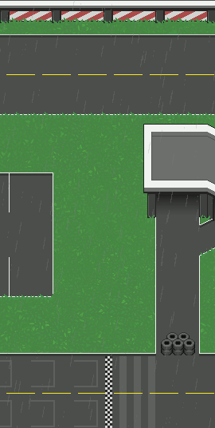
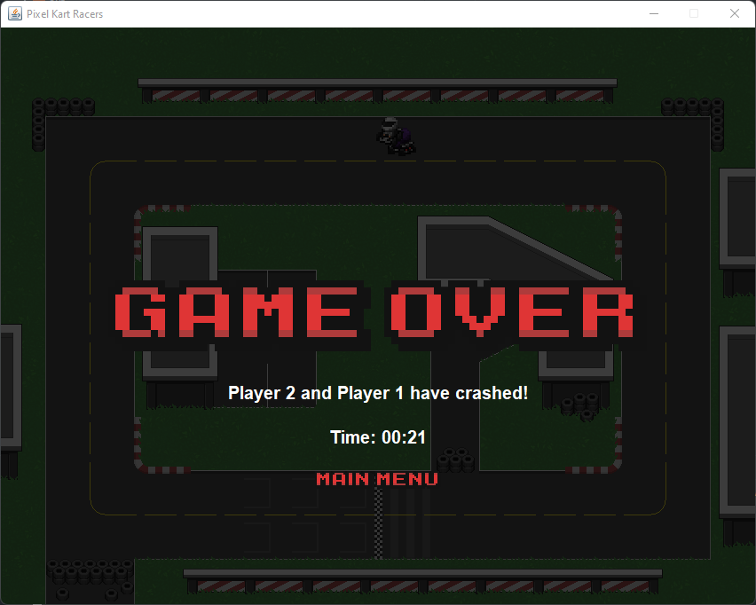

<h1 align="center">
  
</h1>

<details><summary><b>Contents</b></summary>
  <ul>
    <li><a href="#karts">Karts</a></li>
    <li><a href="#maps">Maps & Weather</a></li>
    <li><a href="#screenshots">Screenshots</a></li>
    <li><a href="#install">How to Install</a></li>
    <li><a href="#tutorial">How to Use</a></li>
  </ul>
</details>

<br>

This is part of the coursework for the Distributed Programming course in the final year of my Computer Science degree. The goal was to learn how to build a distributed system using a client-server architecture.

The server part acts as a host by relaying information between connected clients. Both the server and client use a language of commands to perform tasks required of the other, which can be seen <a href="https://github.com/omosborne/java-online-multiplayer-racing-game/blob/main/src/game/client/ServerHandler.java#L183-L205">here</a> for the server handling on the client, and <a href="https://github.com/omosborne/java-online-multiplayer-racing-game/blob/main/src/game/server/ClientHandler.java#L243-L264">here</a> for the client handling on the server. The server was written in a way to support any number of clients but this would come at the cost of higher latency and players appearing to jump around the race track. A limit of up to 6 players was used to ensure low latency and a smoother gaming experience.

The game itself consists of joining a server lobby, choosing a kart and map, racing around a track for 3 laps without crashing into other karts, and crossing the finish line first to win.

<br>

<h2 id="karts" align="center">
  Karts
</h2>

<div align="center">
  
</div>

<br>

<div align="center">
  
</div>

<br>

The karts, racetracks, and UI graphics were custom-made for this project, taking up a substantial part of early development time and iterating over designs until creating the final version used in the game. As seen above, the design process involved drawing the kart for all 16 directions (12.5-degree increments) and using a slight top-down approach allowed for a 3D-like appearance. In total, there are 7 kart colours and 3 racetracks.

<br>

<h2 id="maps" align="center">
  Maps & Weather
</h2>

<table align="center">
  <tr>
    <th>Grass</td>
    <th>Sand</td>
    <th>Urban</td>
  </tr>
  <tr>
    <td></td>
    <td></td>
    <td></td>
  </tr>
  <tr>
    <td></td>
    <td></td>
    <td></td>
  </tr>
</table>

<br>

A weather system was implemented late into development and allows for a chance of poor weather. This weather chance is set to 50% <a href="https://github.com/omosborne/java-online-multiplayer-racing-game/blob/main/src/game/server/GameManager.java#L71">here</a>  and is allocated server-side so all connected clients have the same displayed map and weather. There is also a random racetrack option in the lobby, which means the server will randomly choose one and set it to the same for all connected clients.

<br>

<h2 id="screenshots" align="center">
  Screenshots
</h2>

<div align="center">
  
  <br>
  <p>Title screen.</p>
  <br>
  
  <br>
  <p>If a server is running, then a player can join a game on their network or online.</p>
  <br>
  
  <br>
  <p>Up to 6 players can join a single game, if the lobby is full, new players can't join.</p>
  <br>
  
  <br>
  <p>There are 7 karts and 3 maps to choose from. The game starts when all players are ready.</p>
  <br>
  
  <br>
  <p>The race begins after a countdown: 3.. 2.. 1.. GO!</p>
  <br>
  
  <br>
  <p>An arrow is used to indicate the player's kart, but no two karts are the same colour.</p>
  <br>
  
  <br>
  <p>There are 3 laps, crossing all checkpoints and the finish line will update lap UI.</p>
  <br>
  
  <br>
  <p>Going around the racetrack in the opposite direction will alert the user.</p>
  <br>
  
  <br>
  <p>When the player wins the race, the winner and their race time is displayed.</p>
  <br>
  
  <br>
  <p>If another player wins the race, the race is immediately over.</p>
  <br>
  
  <br>
  <p>Pressing the 'Esc' key will pause the game for the player but still update other kart positions.</p>
  <br>
  
  <br>
  <p>If other players disconnect during a race, the game ends if less than 2 karts are remaining.</p>
  <br>
  
  <br>
  <p>The game ends if 2 karts crash into each other.</p>
  <br>
</div>

<br>

<h2 id="install" align="center">
  How to Install
</h2>

1. Clone the repository via GitHub or Git
```bash
$ git clone https://github.com/omosborne/java-online-multiplayer-racing-game
```

2. Open the project in IntelliJ IDEA

3. In the run configurations of IntelliJ, select Java 18 as the SDK

4. Select `game.server.Main` as the entry point and click `OK`

5. Create a new run configuration and select `game.client.Main`

6. If you want to run two clients on one computer, click `Modify options` and select `Allow multiple instances`

7. Click `OK` to complete run configurations

<br>

<h2 id="tutorial" align="center">
  How to Use
</h2>

1. Run the server instance (created in step 4 of the installation guide)

2. Run the client instance (created in step 5 of the installation guide)

3. If you have only one computer to test, run another client instance (ensure step 6 of the installation guide is completed)

4. The game can be muted by selecting `Mute` in the bottom left corner, this helps if running two clients at the same time

5. Select `Join Local Game` to join the lobby of the server instance you are running

6. Connect any other clients the same way.

7. Your kart is identified with the green title (example: P1)

8. Click on the arrows to the sides of your green title to change the kart colour

9. Click on the arrows to the sides of the map title to change the map, any player in the lobby can change the map

10. Click `Ready` in the top right when you are ready to begin

11. When all players are ready, the game will begin

12. The race counts down from 3, the race will start after `GO!` is displayed.

13. There are 3 laps, going the wrong way will not count as a lap

14. If 2 karts collide, the race is over

15. Click the `Esc` key during the race to access the pause menu

16. If players disconnect, the game is over when no opponents remain

17. Crossing the finish line first after 3 laps wins the race, the race is over for all other players after this point

18. Players are brought back to the title screen if they wish to play again

19. When finished, close any open clients to automatically terminate client instances

20. Remember to terminate the server instance by using the red `Stop` button in IntelliJ
